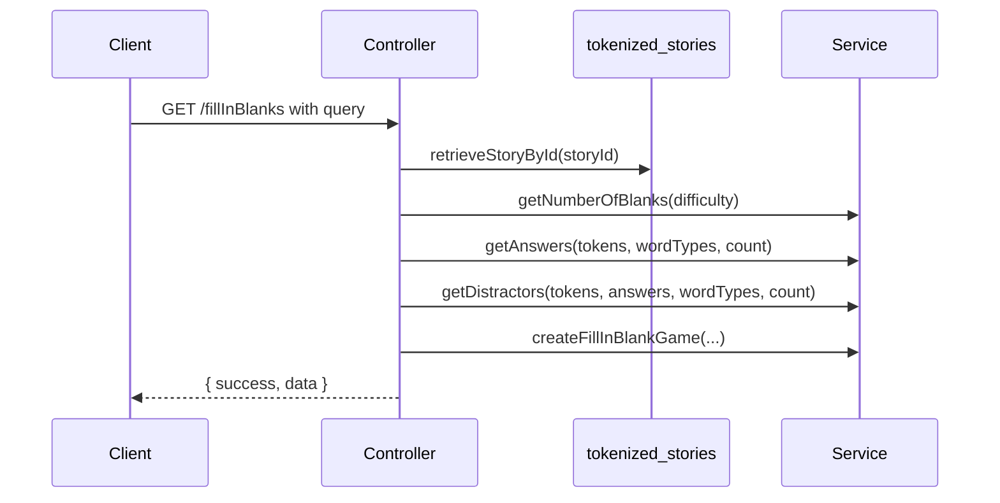

# Context Cloze Quest: Backend

> Last verified: 2026-07-21.

## Module structure

The backend feature is named `fillinblanks`, while the product/game name is Context Cloze Quest.

```text
server/fillinblanks/
|-- routes/fillinblanksroutes.js
|-- controller/fillinblankscontroller.js
|-- controller/contextClozeQuestScoreController.js
|-- services/fillinblankservice.js
|-- services/contextClozeQuestScoreService.js
`-- db/contextClozeQuestCollection.js
```

`server/app.js` mounts the router at `/api/v1/fillInBlanks`.

## Puzzle request flow



The controller chooses `${language}Version` for passage text and `tokenized_${language}_version` for tokens. Passage arrays are joined with spaces and nested token arrays are flattened.

## Puzzle generation rules

### Blank count

| Difficulty | Requested blanks |
| --- | ---: |
| `easy` | 3 |
| `medium` | 6 |
| `hard` | 9 |
| Unknown/missing | 3 |

### Answers

An eligible token must have string `text`, contain at least one Unicode letter/mark, and have `pos` or `upos` included in the requested POS list. Answer text is deduplicated, shuffled, and sliced to the requested count.

The server may return fewer blanks than the difficulty target when the story does not contain enough unique eligible words.

### Distractors

The service first selects unique unused words with one of the requested POS tags. If there are not enough, it fills from other playable tokens. It requests as many distractors as blanks, but may return fewer if the story lacks unique words.

### Passage replacement

Selected answers are sorted by their first `indexOf()` position in the original paragraph. The service then replaces the first matching occurrence of each answer with `_____`. The sorted answer order becomes the blank-answer order. The word bank is a shuffled combination of answers and distractors.

This is literal, case-sensitive string replacement rather than token-offset replacement. Substrings, repeated words, punctuation, and casing therefore deserve regression tests when this algorithm changes.

## Score persistence

The POST controller passes client-supplied data to `saveBestScore()`. Validation currently requires:

- `uuid` to be a non-empty string.
- `score` to be a finite, non-negative number.
- `bestTime` to be a finite, non-negative number.

The collection is `context_cloze_quest` in the `word_complex` database. `_id` is the supplied Firebase user ID. A result replaces the stored document only if it has a higher score, or the same score with a faster time.

Stored fields are:

```text
_id, displayName, bestScore, bestTime, storyId, difficulty, updatedAt
```

There is one record per user globally, not one per story, language, or difficulty. `storyId` and `difficulty` describe the stored best attempt.

## Leaderboard

The leaderboard sorts by `bestScore` descending and then `bestTime` ascending. `limit` defaults to 10 and is clamped to 1 through 100.

## Error behavior

- Missing `storyId`: puzzle controller returns HTTP 400.
- Puzzle retrieval/generation error: controller returns HTTP 500 with the error message.
- Invalid score: score controller returns HTTP 400.
- Leaderboard/database error: leaderboard controller returns HTTP 500.

## Security and trust boundary

The Context Cloze Quest routes currently have no authentication middleware. The frontend avoids posting guest results, but the server accepts a caller-supplied UUID, display name, score, time, story, and difficulty. Consequently, the leaderboard is not authoritative against direct API manipulation.

If leaderboard integrity becomes a requirement, verify a Firebase ID token on the server, derive the UUID from that verified identity, and validate or calculate the score server-side.

## Tests

Relevant existing tests are:

- `server/fillinblanks/fillinblankservice.test.js`
- `server/fillinblanks/fillinblankscontroller.test.js`

When changing scoring persistence, also add focused tests for `contextClozeQuestScoreService` and its controller. Important cases include a first score, higher/lower score, equal score with faster/slower time, invalid input, leaderboard ordering, and limit clamping.

