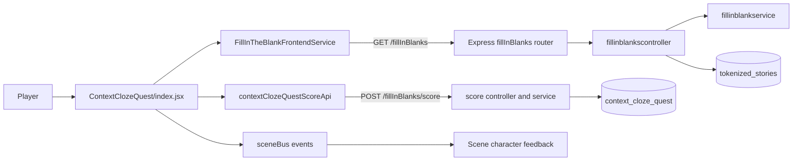

# Context Cloze Quest: Overview

> Last verified: 2026-07-21 against the current repository implementation.

## Purpose

Context Cloze Quest is a Word Complex canvas game in which a player restores words removed from a selected story. The player chooses a language, one or more parts of speech, and a difficulty. The server then selects eligible words from the tokenized story and returns a passage with blanks plus a shuffled word bank.

This file is the documentation entry point. See the related documents for details:

- [Frontend](./ContextClozeQuest_frontend.md)
- [Backend](./ContextClozeQuest_backend.md)
- [Gameplay and scoring](./ContextClozeQuest_gameplay.md)
- [API contract](./ContextClozeQuest_api.md)
- [Local setup and deployment](./ContextClozeQuest_deployment.md)
- [Troubleshooting](./ContextClozeQuest_troubleshooting.md)

## Technology

| Area | Technology |
| --- | --- |
| UI shell | React 19 and Vite |
| Game rendering | ZIM 17 canvas objects |
| Server | Node.js and Express 5 |
| Data | MongoDB Atlas, database `word_complex` |
| Authentication context | Firebase user supplied by the application |
| Tests | Jest; Playwright is configured in the client |

## Architecture

## End-to-end flow

1. The application requires the player to select a story. Its ID is held in `client/src/storyPicker/activeStory.js` for the current browser session.
2. The game registry loads the component and passes application-level properties such as `authUser`.
3. The menu collects language, word types, and difficulty.
4. `getFillInBlanks()` requests a generated puzzle for the selected story.
5. The server retrieves the story, selects eligible tokenized words, replaces their first occurrences with blanks, adds distractors, and returns the puzzle.
6. The frontend renders the passage and draggable word buttons entirely in ZIM.
7. The frontend evaluates the submitted arrangement and calculates the score.
8. If the user is authenticated and is not a guest, the frontend submits the result. The server keeps it only when it beats that user's existing result.

## Important source locations

| Responsibility | Location |
| --- | --- |
| Game UI and client scoring | `client/src/games/ContextClozeQuest/index.jsx` |
| React/ZIM lifecycle wrapper | `client/src/games/createZimGame.jsx` |
| Game registry | `client/src/games/index.js` |
| Puzzle API client | `client/src/services/FillInTheBlankFrontendService.js` |
| Score API client | `client/src/services/contextClozeQuestScoreApi.js` |
| Story selection state | `client/src/storyPicker/activeStory.js` |
| Shared hint policy/button | `client/src/games/shared/hintPolicy.js`, `hintButton.js` |
| Express routes | `server/fillinblanks/routes/fillinblanksroutes.js` |
| Puzzle controller/service | `server/fillinblanks/controller/fillinblankscontroller.js`, `services/fillinblankservice.js` |
| Score controller/service/database | `server/fillinblanks/controller/contextClozeQuestScoreController.js`, `services/contextClozeQuestScoreService.js`, `db/contextClozeQuestCollection.js` |

## Maintenance rules

- Update these documents in the same pull request as changes to gameplay, API fields, setup, or scoring.
- Describe responsibilities and contracts here; explain non-obvious algorithms with nearby source comments.
- Treat the code as the final authority if this document and implementation disagree, then correct the documentation.
- Never place real database URLs, Firebase credentials, or user data in documentation.

