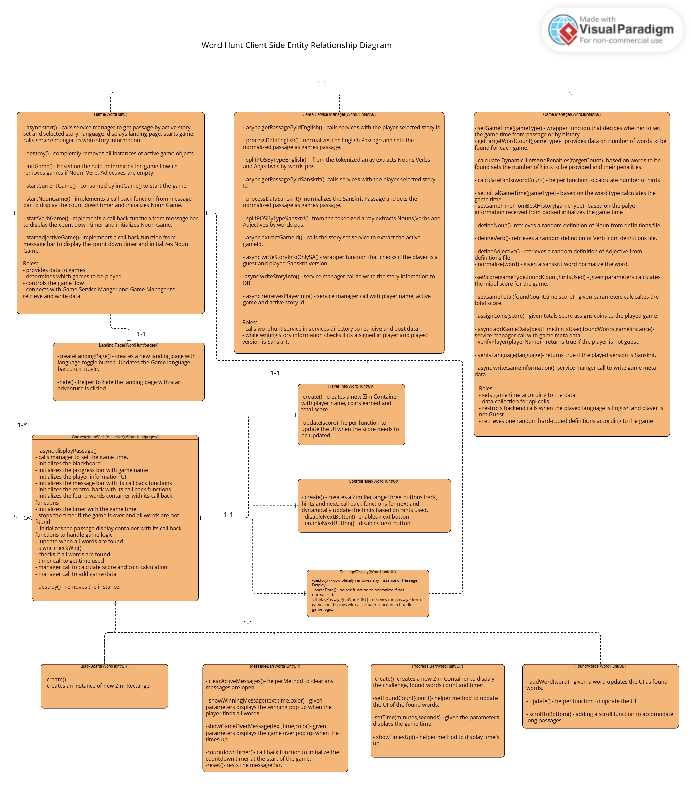

# Game Architecture

The game follows an object-oriented architecture where the `Game` class
acts as the central controller. UI components, game modes, and services
are separated into independent classes.

## Class Diagram

---

## Main Classes

### Game

The central controller responsible for:

- Initializing the application
- Loading story data
- Managing game state
- Switching between mini-games
- Cleaning resources

#### Methods

| Method                 | Description                                                                                       |
| ---------------------- | ------------------------------------------------------------------------------------------------- |
| `start()`              | Loads story data, creates the landing page, and begins the game flow.                             |
| `destroy()`            | Removes active game instances and cleans timers/listeners.                                        |
| `initGame()`           | Determines which mini-games should be played based on the available nouns, verbs, and adjectives. |
| `startCurrentGame()`   | Starts the current game in the queue.                                                             |
| `startNounGame()`      | Displays countdown and launches the noun game.                                                    |
| `startVerbGame()`      | Displays countdown and launches the verb game.                                                    |
| `startAdjectiveGame()` | Displays countdown and launches the adjective game.                                               |
| `nextGame()`           | Advances to the next available game.                                                              |

---

### LandingPage

Responsible for displaying the game's home screen.

#### Landing Page Responsibilities

- Shows title and description
- Allows language selection
- Starts the game
- Hides itself after Start Adventure

---

### FindNounsGame

Responsible for the noun game.

#### Find Nouns Game Responsibilities

- Displays passage
- Detects noun clicks
- Calculates score
- Handles hints
- Starts timer
- Detects win/time-out
- Sends results to backend

---

### FindVerbGame

Same responsibilities as `FindNounsGame`, but for verbs.

---

### FindAdjectiveGame

Same responsibilities as `FindNounsGame`, but for adjectives.

---

### MessageBar

Responsible for all game overlays.

#### Message Bar Responsibilities

- Countdown animation
- Hint popups
- Winning dialog
- Time-over dialog
- Restart / Continue / Exit buttons

---

### PassageDisplay

Responsible for rendering the passage.

#### Passage Display Responsibilities

- Creates clickable word labels
- Stores label references
- Destroys previous passages

---

### Timer

Responsible for:

- Countdown
- Elapsed time
- Timeout callback

---

### GameManager

Responsible for game logic.

#### Game Manager Responsibilities

- Score calculation
- Time calculation
- Coin calculation
- Hint penalties
- Database updates

---

### GameServiceManager

Responsible for service layer communication with service to perform GET & POST.

#### Game Service ManagerResponsibilities

- Retrieve story
- Retrieve player information
- Write story progress
- Write game results
